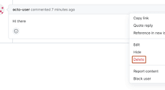

# Usage Guide

## Step 1: Create an issue from template

Create an issue from template to specify source repositories.
Go to issues -> [New issue](/issues/new/choose)  
Select the issue template depending on your source and target. If you are not sure which template to use, ask your GitHub administrator.

- Specify repositories to migrate in issue's body.

  > **Tip**: You can specify multiple repositories in one issue.

- Specify the target repository visibility.

## Step 2: Perform a dry-run migration

Dry-run migration will not lock your source repository and therefore does not block your users from continuing to work on the source repository.

Add the following comment to the issue to perform a dry-run migration:

```sh
/run-dry-run-migration
```

## Step 3: Verify migrated repository

Verify that migration was completed successfully.

In order to delete the migrated repositories of the dry-run, add a comment with the following command:

```sh
/delete-repositories GUID
```

## Step 4: Add users to user-mappings.csv file

The dry-run migration will create a `user-mappings-template.csv` file and add it to the build artifacts for the workflow run. To find this file, follow the link to the workflow run in the issue comment...  


Scroll to the bottom of the workflow summary page to find the artifacts...  


Download the `user-mappings-template.csv` file and add your target users to it. The file should have the following format:

```csv
source,target
steffenhiller,steffen
```

If migrating with GitHub Enterprise Importer (GEI), the `user-mappings-template.csv` file should have following format:

```csv
mannequin-user,mannequin-id,target-user
steffenhiller,u0001,steffen
```

Merge your completed template file with `user-mappings.csv` file, or `user-mappings-gei.csv` file if using GEI. Create a pull request to this repository with additions to the appropriate file. After this file is merged to main, it will be used in future migrations, both dry-run and production, to map source users to target users.

## Step 5: Perform production migration

After you have verified your dry-run migration and after you have announced the production migration to your users, create a comment with the following command to start the production migration:

```sh
/run-production-migration
```

It will lock your source repository and make it **inaccessible** for your users.